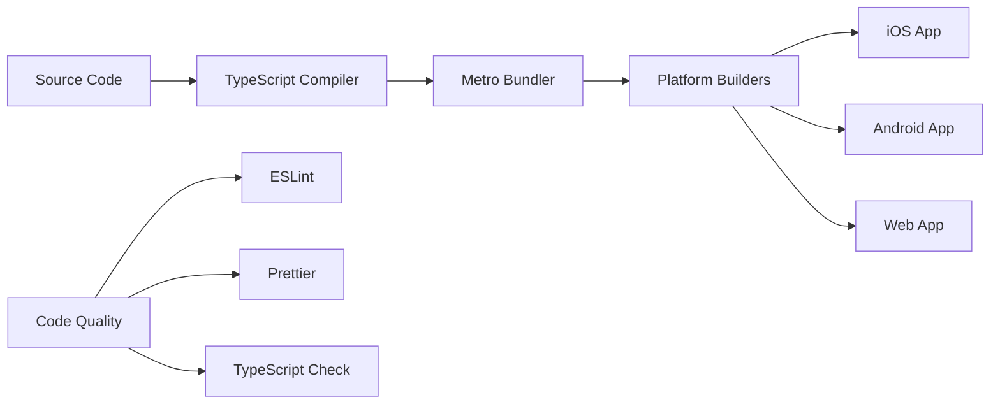
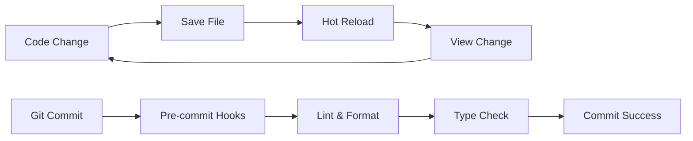

# TIM-001: Development Environment & Project Setup

**TIM ID:** TIM-001  
**Module Name:** Development Environment & Project Setup  
**Version:** 1.0  
**Date:** December 2024  
**Estimated Time:** 3-4 days  
**Priority:** High  
**Dependencies:** None

---

## **1. MODULE OVERVIEW**

### **1.1 Purpose**
Establish a complete development environment for the ConsciousBudget cross-platform application, including React Native setup, TypeScript configuration, development tools, and project infrastructure that will support iOS, Android, and Web platforms.

### **1.2 Scope**
**In Scope:**
- React Native project initialization with React Native Web support
- TypeScript configuration and setup
- Development tools (ESLint, Prettier, debugging tools)
- Git workflow and repository structure
- CI/CD pipeline basic setup
- Code standards and formatting rules
- Cross-platform build configuration
- Development environment verification

**Out of Scope:**
- Google services integration (covered in TIM-003)
- Specific feature implementations
- Production deployment configuration
- App store submission setup

### **1.3 Dependencies**
| Dependency | Type | Description | Status |
|------------|------|-------------|--------|
| None | - | This is the foundation module | Complete |

### **1.4 Success Criteria**
- [ ] React Native project running on iOS simulator
- [ ] React Native project running on Android emulator
- [ ] Web version accessible in browser
- [ ] TypeScript compilation working without errors
- [ ] All linting and formatting tools configured
- [ ] Git workflow and hooks functioning
- [ ] Development team can clone and run project
- [ ] CI/CD pipeline executing basic checks

---

## **2. FUNCTIONAL REQUIREMENTS**

### **2.1 User Stories**

#### **Story 1: Developer Environment Setup**
```
As a developer
I want to set up the development environment quickly
So that I can start implementing features without configuration delays
```

**Acceptance Criteria:**
- [ ] Given a fresh development machine, when I follow the setup instructions, then I can run the app on all platforms within 30 minutes
- [ ] Given the project is cloned, when I run `npm install && npm start`, then the development server starts without errors
- [ ] Error scenario: Given missing dependencies, when setup fails, then clear error messages guide the developer to resolution

#### **Story 2: Code Quality Enforcement**
```
As a development team lead
I want automated code quality checks
So that we maintain consistent code standards across the team
```

**Acceptance Criteria:**
- [ ] Given code is committed, when it doesn't meet standards, then the commit is rejected with specific feedback
- [ ] Given code is pushed, when it contains TypeScript errors, then the CI pipeline fails with clear error messages
- [ ] Given code is formatted incorrectly, when the developer runs format command, then code is automatically fixed

#### **Story 3: Cross-Platform Development**
```
As a developer
I want to develop for all platforms simultaneously
So that I can ensure feature parity and efficient development
```

**Acceptance Criteria:**
- [ ] Given a code change, when I save the file, then hot reload works on all active platforms
- [ ] Given platform-specific code is needed, when I use platform extensions, then the correct code loads for each platform
- [ ] Given shared components, when I modify them, then changes appear on all platforms

### **2.2 Business Logic**
```typescript
// Environment validation logic
interface EnvironmentValidation {
  nodeVersion: string;
  reactNativeVersion: string;
  platformRequirements: {
    ios: boolean;
    android: boolean;
    web: boolean;
  };
  toolsInstalled: {
    xcode?: boolean;
    androidStudio?: boolean;
    vscode?: boolean;
  };
}

const validateEnvironment = (env: EnvironmentValidation): boolean => {
  // Validation logic for environment setup
  return true;
};
```

### **2.3 Edge Cases**
| Scenario | Input | Expected Behavior | Error Handling |
|----------|-------|-------------------|----------------|
| Node.js wrong version | Node < 18.0.0 | Setup script fails with version message | Clear upgrade instructions |
| Missing Xcode | iOS build attempt | Build fails with helpful message | Guide to Xcode installation |
| Port already in use | npm start | Metro bundler fails to start | Suggest alternative port or kill process |
| Android SDK missing | Android build | Build fails with SDK message | Guide to Android Studio setup |

### **2.4 Performance Requirements**
- **Startup Time:** Development server should start within 30 seconds
- **Hot Reload:** Code changes should reflect within 2 seconds
- **Build Time:** Initial build should complete within 3 minutes
- **Memory Usage:** Development tools should not exceed 2GB RAM usage

---

## **3. TECHNICAL ARCHITECTURE**

### **3.1 Component Architecture**
```
ConsciousBudget Project
├── Development Environment
│   ├── Node.js (18+)
│   ├── React Native CLI
│   └── Platform SDKs
├── Project Structure
│   ├── src/ (TypeScript source)
│   ├── ios/ (iOS native code)
│   ├── android/ (Android native code)
│   └── web/ (Web-specific assets)
├── Build Tools
│   ├── Metro Bundler
│   ├── TypeScript Compiler
│   └── Platform Builders
└── Development Tools
    ├── ESLint
    ├── Prettier
    ├── VS Code Extensions
    └── Debugging Tools
```

### **3.2 Data Flow**


### **3.3 Integration Points**
| Component | Interface | Data Format | Error Handling |
|-----------|-----------|-------------|----------------|
| Metro Bundler | CLI/Config | JavaScript bundles | Build error reporting |
| TypeScript | CLI/Config | Compiled JS | Type error reporting |
| ESLint | CLI/Config | Lint results | Rule violation reporting |
| Platform SDKs | CLI/Build | Native apps | Platform-specific errors |

### **3.4 Technology Stack**
- **Primary:** React Native 0.72+, TypeScript 5.0+, Node.js 18+
- **Libraries:** React Native Web, React Navigation, AsyncStorage
- **Tools:** Metro, ESLint, Prettier, Flipper, React DevTools
- **Platform Tools:** Xcode, Android Studio, VS Code

---

## **4. DATA MODELS & SCHEMA**

### **4.1 Data Structures**
```typescript
// Development configuration types
interface ProjectConfig {
  name: string;
  version: string;
  platforms: ('ios' | 'android' | 'web')[];
  typescript: boolean;
  eslintConfig: string;
  prettierConfig: string;
}

interface BuildConfig {
  development: {
    sourceMaps: boolean;
    debugMode: boolean;
    hotReload: boolean;
  };
  production: {
    minify: boolean;
    bundleAnalyzer: boolean;
    sourceMaps: boolean;
  };
}
```

### **4.2 Configuration Schema**
```json
// package.json structure
{
  "name": "conscious-budget",
  "version": "1.0.0",
  "private": true,
  "scripts": {
    "android": "react-native run-android",
    "ios": "react-native run-ios",
    "web": "react-native-web-start",
    "start": "react-native start",
    "test": "jest",
    "lint": "eslint . --ext .js,.jsx,.ts,.tsx",
    "type-check": "tsc --noEmit"
  }
}
```

### **4.3 Data Validation Rules**
```typescript
const projectValidation = {
  name: {
    required: true,
    type: 'string',
    pattern: /^[a-z0-9-]+$/,
    minLength: 3,
    maxLength: 50
  },
  version: {
    required: true,
    type: 'string',
    pattern: /^\d+\.\d+\.\d+$/
  }
};
```

### **4.4 Sample Configuration**
```json
{
  "project": {
    "name": "conscious-budget",
    "displayName": "ConsciousBudget",
    "version": "1.0.0",
    "platforms": ["ios", "android", "web"],
    "typescript": true
  }
}
```

---

## **5. API SPECIFICATIONS**

### **5.1 Development Scripts Interface**
```typescript
// Package.json scripts interface
interface DevelopmentScripts {
  start(): Promise<void>;
  build(platform: 'ios' | 'android' | 'web'): Promise<void>;
  test(): Promise<TestResults>;
  lint(): Promise<LintResults>;
  format(): Promise<void>;
}
```

### **5.2 Configuration API**
```typescript
// Metro configuration
interface MetroConfig {
  resolver: {
    platforms: string[];
    alias: Record<string, string>;
  };
  transformer: {
    getTransformOptions: () => TransformOptions;
  };
}

// TypeScript configuration
interface TypeScriptConfig {
  compilerOptions: {
    target: string;
    lib: string[];
    allowJs: boolean;
    skipLibCheck: boolean;
    esModuleInterop: boolean;
    allowSyntheticDefaultImports: boolean;
    strict: boolean;
    forceConsistentCasingInFileNames: boolean;
    moduleResolution: string;
    resolveJsonModule: boolean;
    isolatedModules: boolean;
    noEmit: boolean;
    jsx: string;
  };
}
```

### **5.3 Error Handling**
| Error Type | Description | Response | Action |
|------------|-------------|----------|--------|
| Build Error | TypeScript/Bundle error | Detailed error with file/line | Fix syntax/type errors |
| Lint Error | Code quality violation | List of violations | Run lint --fix or manual fix |
| Environment Error | Missing dependencies | Setup validation failure | Install missing dependencies |

---

## **6. UI/UX SPECIFICATIONS**

### **6.1 Development Tools UI**
```
Development Environment
├── VS Code (Primary IDE)
│   ├── React Native Extension
│   ├── TypeScript Support
│   ├── ESLint Integration
│   └── Prettier Integration
├── Terminal/Command Line
│   ├── npm/yarn commands
│   ├── React Native CLI
│   └── Git commands
├── Browser (Web Development)
│   ├── React DevTools
│   ├── Network Inspector
│   └── Console
└── Mobile Simulators
    ├── iOS Simulator
    └── Android Emulator
```

### **6.2 Developer Experience**
- **Hot Reload:** Immediate feedback on code changes
- **Error Overlays:** Clear error messages in development
- **Debug Console:** Easy access to logs and debugging
- **Live Reload:** Full app reload when needed

### **6.3 Development Workflow**


---

## **7. IMPLEMENTATION STEPS**

### **7.1 File Structure**
```
conscious-budget/
├── src/
│   ├── components/
│   ├── screens/
│   ├── services/
│   ├── types/
│   ├── utils/
│   └── App.tsx
├── ios/
│   └── ConsciousBudget/
├── android/
│   └── app/
├── web/
│   ├── public/
│   └── webpack.config.js
├── __tests__/
├── .github/
│   └── workflows/
├── docs/
├── .gitignore
├── .eslintrc.js
├── .prettierrc
├── tsconfig.json
├── metro.config.js
├── package.json
└── README.md
```

### **7.2 Implementation Sequence**

#### **Step 1: Environment Prerequisites** (2 hours)
1. **Install Node.js 18+**
   ```bash
   # Download from nodejs.org or use package manager
   # macOS with Homebrew
   brew install node@18
   
   # Verify installation
   node --version  # Should be >= 18.0.0
   npm --version   # Should be >= 9.0.0
   ```

2. **Install React Native CLI**
   ```bash
   npm install -g react-native-cli
   npm install -g @react-native-community/cli
   ```

3. **Platform-specific setup**
   ```bash
   # iOS (macOS only)
   # Install Xcode from App Store
   # Install Xcode command line tools
   xcode-select --install
   
   # Install CocoaPods
   sudo gem install cocoapods
   
   # Android
   # Install Android Studio from developer.android.com
   # Set ANDROID_HOME environment variable
   export ANDROID_HOME=$HOME/Library/Android/sdk
   export PATH=$PATH:$ANDROID_HOME/emulator
   export PATH=$PATH:$ANDROID_HOME/tools
   export PATH=$PATH:$ANDROID_HOME/tools/bin
   export PATH=$PATH:$ANDROID_HOME/platform-tools
   ```

#### **Step 2: Project Initialization** (3 hours)
1. **Create React Native project**
   ```bash
   npx react-native init ConsciousBudget --template react-native-template-typescript
   cd ConsciousBudget
   ```

2. **Install React Native Web**
   ```bash
   npm install react-native-web react-dom
   npm install -D @types/react-dom webpack webpack-cli webpack-dev-server
   npm install -D html-webpack-plugin babel-loader
   ```

3. **Configure package.json**
   ```json
   {
     "name": "conscious-budget",
     "version": "0.1.0",
     "private": true,
     "scripts": {
       "android": "react-native run-android",
       "ios": "react-native run-ios",
       "start": "react-native start",
       "web": "webpack serve --config web/webpack.config.js --mode development",
       "test": "jest",
       "lint": "eslint . --ext .js,.jsx,.ts,.tsx",
       "lint:fix": "eslint . --ext .js,.jsx,.ts,.tsx --fix",
       "format": "prettier --write \"**/*.{js,jsx,ts,tsx,json,md}\"",
       "type-check": "tsc --noEmit",
       "prepare": "husky install"
     },
     "dependencies": {
       "react": "18.2.0",
       "react-native": "0.72.6",
       "react-native-web": "^0.19.9",
       "react-dom": "18.2.0"
     },
     "devDependencies": {
       "@types/react": "^18.2.37",
       "@types/react-dom": "^18.2.15",
       "@typescript-eslint/eslint-plugin": "^6.10.0",
       "@typescript-eslint/parser": "^6.10.0",
       "eslint": "^8.53.0",
       "eslint-plugin-react": "^7.33.2",
       "eslint-plugin-react-hooks": "^4.6.0",
       "eslint-plugin-react-native": "^4.1.0",
       "prettier": "^3.1.0",
       "typescript": "^5.2.2",
       "webpack": "^5.89.0",
       "webpack-cli": "^5.1.4",
       "webpack-dev-server": "^4.15.1",
       "html-webpack-plugin": "^5.5.3",
       "babel-loader": "^9.1.3",
       "husky": "^8.0.3",
       "lint-staged": "^15.1.0"
     }
   }
   ```

#### **Step 3: TypeScript Configuration** (1 hour)
1. **Create tsconfig.json**
   ```json
   {
     "compilerOptions": {
       "target": "ES2020",
       "lib": ["ES2020", "DOM"],
       "allowJs": true,
       "skipLibCheck": true,
       "esModuleInterop": true,
       "allowSyntheticDefaultImports": true,
       "strict": true,
       "forceConsistentCasingInFileNames": true,
       "noFallthroughCasesInSwitch": true,
       "module": "ESNext",
       "moduleResolution": "node",
       "resolveJsonModule": true,
       "isolatedModules": true,
       "noEmit": true,
       "jsx": "react-jsx",
       "baseUrl": "./src",
       "paths": {
         "@/*": ["*"],
         "@/components/*": ["components/*"],
         "@/screens/*": ["screens/*"],
         "@/services/*": ["services/*"],
         "@/types/*": ["types/*"],
         "@/utils/*": ["utils/*"]
       }
     },
     "include": [
       "src/**/*",
       "web/**/*"
     ],
     "exclude": [
       "node_modules",
       "ios",
       "android"
     ]
   }
   ```

2. **Create types directory**
   ```bash
   mkdir -p src/types
   ```

3. **Create global types file**
   ```typescript
   // src/types/global.d.ts
   declare module '*.svg' {
     import React from 'react';
     import { SvgProps } from 'react-native-svg';
     const content: React.FC<SvgProps>;
     export default content;
   }
   
   declare module '*.png' {
     const content: any;
     export default content;
   }
   
   declare module '*.jpg' {
     const content: any;
     export default content;
   }
   ```

#### **Step 4: ESLint and Prettier Setup** (2 hours)
1. **Create .eslintrc.js**
   ```javascript
   module.exports = {
     root: true,
     extends: [
       '@react-native-community',
       '@typescript-eslint/recommended',
       'plugin:react/recommended',
       'plugin:react-hooks/recommended',
       'plugin:react-native/all',
     ],
     parser: '@typescript-eslint/parser',
     plugins: ['@typescript-eslint', 'react', 'react-hooks', 'react-native'],
     parserOptions: {
       ecmaFeatures: {
         jsx: true,
       },
       ecmaVersion: 2020,
       sourceType: 'module',
     },
     env: {
       'react-native/react-native': true,
       es6: true,
       node: true,
     },
     rules: {
       // TypeScript
       '@typescript-eslint/no-unused-vars': 'error',
       '@typescript-eslint/explicit-function-return-type': 'off',
       '@typescript-eslint/explicit-module-boundary-types': 'off',
       '@typescript-eslint/no-explicit-any': 'warn',
       '@typescript-eslint/no-empty-function': 'off',
       
       // React
       'react/react-in-jsx-scope': 'off',
       'react/prop-types': 'off',
       'react-hooks/rules-of-hooks': 'error',
       'react-hooks/exhaustive-deps': 'warn',
       
       // React Native
       'react-native/no-unused-styles': 'error',
       'react-native/split-platform-components': 'error',
       'react-native/no-inline-styles': 'warn',
       'react-native/no-color-literals': 'warn',
       
       // General
       'no-console': 'warn',
       'prefer-const': 'error',
       'no-var': 'error',
     },
     settings: {
       react: {
         version: 'detect',
       },
     },
   };
   ```

2. **Create .prettierrc**
   ```json
   {
     "semi": true,
     "trailingComma": "es5",
     "singleQuote": true,
     "printWidth": 80,
     "tabWidth": 2,
     "useTabs": false,
     "bracketSpacing": true,
     "arrowParens": "avoid",
     "endOfLine": "lf"
   }
   ```

3. **Create .eslintignore**
   ```
   node_modules/
   ios/
   android/
   web/dist/
   coverage/
   *.config.js
   ```

#### **Step 5: Web Configuration** (2 hours)
1. **Create web directory structure**
   ```bash
   mkdir -p web/public
   ```

2. **Create webpack.config.js**
   ```javascript
   // web/webpack.config.js
   const path = require('path');
   const HtmlWebpackPlugin = require('html-webpack-plugin');
   
   module.exports = {
     entry: './web/index.web.js',
     mode: 'development',
     module: {
       rules: [
         {
           test: /\.(js|jsx|ts|tsx)$/,
           exclude: /node_modules/,
           use: {
             loader: 'babel-loader',
             options: {
               presets: [
                 '@babel/preset-env',
                 '@babel/preset-react',
                 '@babel/preset-typescript',
               ],
             },
           },
         },
         {
           test: /\.(png|jpe?g|gif|svg)$/,
           use: {
             loader: 'file-loader',
             options: {
               name: '[name].[ext]',
               outputPath: 'assets/',
             },
           },
         },
       ],
     },
     resolve: {
       extensions: ['.web.js', '.js', '.web.tsx', '.tsx', '.web.ts', '.ts'],
       alias: {
         'react-native$': 'react-native-web',
         '@': path.resolve(__dirname, '../src'),
       },
     },
     output: {
       path: path.resolve(__dirname, 'dist'),
       filename: 'bundle.js',
     },
     plugins: [
       new HtmlWebpackPlugin({
         template: './web/public/index.html',
       }),
     ],
     devServer: {
       static: {
         directory: path.join(__dirname, 'public'),
       },
       compress: true,
       port: 3000,
       historyApiFallback: true,
     },
   };
   ```

3. **Create web entry point**
   ```javascript
   // web/index.web.js
   import { AppRegistry } from 'react-native';
   import App from '../src/App';
   
   AppRegistry.registerComponent('ConsciousBudget', () => App);
   AppRegistry.runApplication('ConsciousBudget', {
     rootTag: document.getElementById('root'),
   });
   ```

4. **Create HTML template**
   ```html
   <!-- web/public/index.html -->
   <!DOCTYPE html>
   <html lang="en">
   <head>
       <meta charset="UTF-8">
       <meta name="viewport" content="width=device-width, initial-scale=1.0">
       <title>ConsciousBudget</title>
   </head>
   <body>
       <div id="root"></div>
   </body>
   </html>
   ```

#### **Step 6: Git Configuration** (1 hour)
1. **Initialize Git repository**
   ```bash
   git init
   git remote add origin https://github.com/Anton94/conscious_budget.git
   ```

2. **Create .gitignore**
   ```
   # Dependencies
   node_modules/
   npm-debug.log*
   yarn-debug.log*
   yarn-error.log*
   
   # Runtime data
   pids
   *.pid
   *.seed
   *.pid.lock
   
   # Coverage directory used by tools like istanbul
   coverage/
   
   # Build outputs
   build/
   dist/
   web/dist/
   
   # React Native
   ios/build/
   android/app/build/
   android/.gradle/
   android/local.properties
   
   # iOS
   ios/Pods/
   ios/Podfile.lock
   *.xcuserstate
   *.xcworkspace
   
   # Android
   *.keystore
   !debug.keystore
   
   # Environment variables
   .env
   .env.local
   .env.development.local
   .env.test.local
   .env.production.local
   
   # IDE
   .vscode/
   .idea/
   *.swp
   *.swo
   *~
   
   # OS
   .DS_Store
   Thumbs.db
   ```

3. **Setup Git hooks with Husky**
   ```bash
   npm install --save-dev husky lint-staged
   npm run prepare
   
   # Add pre-commit hook
   npx husky add .husky/pre-commit "npx lint-staged"
   
   # Add commit-msg hook
   npx husky add .husky/commit-msg 'npx --no -- commitlint --edit ${1}'
   ```

4. **Configure lint-staged**
   ```json
   // Add to package.json
   {
     "lint-staged": {
       "*.{js,jsx,ts,tsx}": [
         "eslint --fix",
         "prettier --write"
       ],
       "*.{json,md}": [
         "prettier --write"
       ]
     }
   }
   ```

#### **Step 7: CI/CD Setup** (2 hours)
1. **Create GitHub Actions workflow**
   ```yaml
   # .github/workflows/ci.yml
   name: CI
   
   on:
     push:
       branches: [ main, develop ]
     pull_request:
       branches: [ main ]
   
   jobs:
     test:
       runs-on: ubuntu-latest
       
       strategy:
         matrix:
           node-version: [18.x]
       
       steps:
       - uses: actions/checkout@v3
       
       - name: Use Node.js ${{ matrix.node-version }}
         uses: actions/setup-node@v3
         with:
           node-version: ${{ matrix.node-version }}
           cache: 'npm'
       
       - name: Install dependencies
         run: npm ci
       
       - name: Run type check
         run: npm run type-check
       
       - name: Run linter
         run: npm run lint
       
       - name: Run tests
         run: npm test
       
       - name: Build for web
         run: npm run web:build
   ```

2. **Create build script for web**
   ```json
   // Add to package.json scripts
   {
     "web:build": "webpack --config web/webpack.config.js --mode production",
     "web:serve": "webpack serve --config web/webpack.config.js --mode development"
   }
   ```

### **7.3 Code Examples**

#### **Example 1: Basic App.tsx Setup**
```typescript
// src/App.tsx
import React from 'react';
import {
  SafeAreaView,
  ScrollView,
  StatusBar,
  StyleSheet,
  Text,
  useColorScheme,
  View,
} from 'react-native';

const App: React.FC = () => {
  const isDarkMode = useColorScheme() === 'dark';

  const backgroundStyle = {
    backgroundColor: isDarkMode ? '#000000' : '#ffffff',
  };

  return (
    <SafeAreaView style={[backgroundStyle, styles.container]}>
      <StatusBar
        barStyle={isDarkMode ? 'light-content' : 'dark-content'}
        backgroundColor={backgroundStyle.backgroundColor}
      />
      <ScrollView contentInsetAdjustmentBehavior="automatic" style={backgroundStyle}>
        <View style={styles.content}>
          <Text style={styles.title}>ConsciousBudget</Text>
          <Text style={styles.subtitle}>Personal Finance Management</Text>
        </View>
      </ScrollView>
    </SafeAreaView>
  );
};

const styles = StyleSheet.create({
  container: {
    flex: 1,
  },
  content: {
    padding: 24,
    alignItems: 'center',
    justifyContent: 'center',
    minHeight: 300,
  },
  title: {
    fontSize: 24,
    fontWeight: '600',
    marginBottom: 16,
    textAlign: 'center',
  },
  subtitle: {
    fontSize: 16,
    fontWeight: '400',
    textAlign: 'center',
    color: '#666666',
  },
});

export default App;
```

#### **Example 2: Metro Configuration**
```javascript
// metro.config.js
const { getDefaultConfig } = require('metro-config');

module.exports = (async () => {
  const {
    resolver: { sourceExts, assetExts },
  } = await getDefaultConfig();
  
  return {
    transformer: {
      babelTransformerPath: require.resolve('react-native-svg-transformer'),
      getTransformOptions: async () => ({
        transform: {
          experimentalImportSupport: false,
          inlineRequires: true,
        },
      }),
    },
    resolver: {
      assetExts: assetExts.filter(ext => ext !== 'svg'),
      sourceExts: [...sourceExts, 'svg'],
      alias: {
        '@': './src',
      },
    },
  };
})();
```

---

## **8. TESTING SPECIFICATIONS**

### **8.1 Unit Tests**
```typescript
// __tests__/App.test.tsx
import React from 'react';
import { render } from '@testing-library/react-native';
import App from '../src/App';

describe('App', () => {
  it('should render correctly', () => {
    const { getByText } = render(<App />);
    expect(getByText('ConsciousBudget')).toBeTruthy();
    expect(getByText('Personal Finance Management')).toBeTruthy();
  });

  it('should have proper styling', () => {
    const { getByText } = render(<App />);
    const title = getByText('ConsciousBudget');
    expect(title.props.style).toMatchObject({
      fontSize: 24,
      fontWeight: '600',
    });
  });
});
```

### **8.2 Environment Tests**
```typescript
// __tests__/environment.test.ts
describe('Development Environment', () => {
  it('should have correct Node.js version', () => {
    const nodeVersion = process.version;
    const majorVersion = parseInt(nodeVersion.slice(1).split('.')[0]);
    expect(majorVersion).toBeGreaterThanOrEqual(18);
  });

  it('should have TypeScript configured', () => {
    const tsConfig = require('../tsconfig.json');
    expect(tsConfig.compilerOptions.strict).toBe(true);
    expect(tsConfig.compilerOptions.jsx).toBe('react-jsx');
  });

  it('should have ESLint configured', () => {
    const eslintConfig = require('../.eslintrc.js');
    expect(eslintConfig.extends).toContain('@typescript-eslint/recommended');
  });
});
```

### **8.3 Manual Testing Checklist**
- [ ] **Development Environment**
  - [ ] Node.js version >= 18.0.0
  - [ ] npm/yarn installed and working
  - [ ] React Native CLI installed globally
  
- [ ] **Platform Setup**
  - [ ] iOS: Xcode installed and configured
  - [ ] iOS: Simulator launches successfully
  - [ ] Android: Android Studio installed
  - [ ] Android: Emulator launches successfully
  - [ ] Web: Browser development tools accessible
  
- [ ] **Project Setup**
  - [ ] `npm install` completes without errors
  - [ ] `npm start` launches Metro bundler
  - [ ] `npm run ios` builds and runs on iOS simulator
  - [ ] `npm run android` builds and runs on Android emulator
  - [ ] `npm run web` serves web version in browser
  
- [ ] **Code Quality**
  - [ ] `npm run lint` runs without errors
  - [ ] `npm run type-check` passes TypeScript validation
  - [ ] `npm run format` formats code correctly
  - [ ] Git pre-commit hooks working
  
- [ ] **Hot Reload**
  - [ ] Code changes reflect on iOS within 2 seconds
  - [ ] Code changes reflect on Android within 2 seconds
  - [ ] Code changes reflect on web within 2 seconds

### **8.4 Performance Benchmarks**
| Metric | Target | Measurement Method |
|--------|--------|--------------------|
| Metro start time | < 30s | `time npm start` |
| iOS build time | < 3min | Xcode build timer |
| Android build time | < 3min | Android Studio build timer |
| Hot reload time | < 2s | Manual testing |
| Web build time | < 1min | Webpack build timer |

---

## **9. CONFIGURATION & SETUP**

### **9.1 Environment Setup Script**
```bash
#!/bin/bash
# setup.sh - Development environment setup script

echo "🚀 Setting up ConsciousBudget development environment..."

# Check Node.js version
NODE_VERSION=$(node --version | cut -d'v' -f2 | cut -d'.' -f1)
if [ "$NODE_VERSION" -lt 18 ]; then
    echo "❌ Node.js version must be 18 or higher"
    echo "Current version: $(node --version)"
    echo "Please install Node.js 18+ from https://nodejs.org"
    exit 1
fi
echo "✅ Node.js version: $(node --version)"

# Install dependencies
echo "📦 Installing dependencies..."
npm install

# Setup iOS (macOS only)
if [[ "$OSTYPE" == "darwin"* ]]; then
    echo "🍎 Setting up iOS dependencies..."
    cd ios && pod install && cd ..
    echo "✅ iOS setup complete"
fi

# Setup Git hooks
echo "🪝 Setting up Git hooks..."
npm run prepare

# Run initial checks
echo "🔍 Running initial checks..."
npm run type-check
npm run lint

echo "✅ Development environment setup complete!"
echo ""
echo "🎯 Next steps:"
echo "  1. npm start     - Start Metro bundler"
echo "  2. npm run ios   - Run on iOS simulator"
echo "  3. npm run android - Run on Android emulator"
echo "  4. npm run web   - Run web version"
```

### **9.2 VS Code Configuration**
```json
// .vscode/settings.json
{
  "typescript.preferences.includePackageJsonAutoImports": "on",
  "typescript.suggest.autoImports": true,
  "editor.codeActionsOnSave": {
    "source.fixAll.eslint": true,
    "source.organizeImports": true
  },
  "editor.formatOnSave": true,
  "editor.defaultFormatter": "esbenp.prettier-vscode",
  "emmet.includeLanguages": {
    "typescript": "html",
    "typescriptreact": "html"
  },
  "files.associations": {
    "*.tsx": "typescriptreact"
  },
  "search.exclude": {
    "**/node_modules": true,
    "ios/": true,
    "android/": true
  }
}
```

```json
// .vscode/extensions.json
{
  "recommendations": [
    "ms-vscode.vscode-typescript-next",
    "bradlc.vscode-tailwindcss",
    "esbenp.prettier-vscode",
    "dbaeumer.vscode-eslint",
    "ms-vscode.vscode-react-native",
    "formulahendry.auto-rename-tag",
    "christian-kohler.path-intellisense",
    "ms-vscode.vscode-json"
  ]
}
```

### **9.3 Build Scripts**
```json
// package.json - Additional build scripts
{
  "scripts": {
    "clean": "rm -rf node_modules && npm install",
    "clean:ios": "cd ios && rm -rf build && pod install && cd ..",
    "clean:android": "cd android && ./gradlew clean && cd ..",
    "reset": "npm run clean && npm run clean:ios && npm run clean:android",
    "dev": "concurrently \"npm start\" \"npm run web\"",
    "build:all": "npm run build:web && npm run build:ios && npm run build:android",
    "build:web": "webpack --config web/webpack.config.js --mode production",
    "build:ios": "react-native run-ios --configuration Release",
    "build:android": "react-native run-android --variant=release"
  }
}
```

---

## **10. VERIFICATION CRITERIA**

### **10.1 Definition of Done**
- [ ] **Environment Complete**
  - [ ] All development tools installed and configured
  - [ ] Project builds successfully on all platforms
  - [ ] Hot reload working on all platforms
  - [ ] No configuration errors or warnings

- [ ] **Code Quality Complete**
  - [ ] ESLint configuration working without errors
  - [ ] TypeScript compilation successful
  - [ ] Prettier formatting applied consistently
  - [ ] Git hooks functioning properly

- [ ] **Documentation Complete**
  - [ ] README.md updated with setup instructions
  - [ ] Development workflow documented
  - [ ] Troubleshooting guide created
  - [ ] Configuration files documented

- [ ] **Team Ready**
  - [ ] Other developers can clone and run project
  - [ ] Setup script works on different machines
  - [ ] CI/CD pipeline executing successfully
  - [ ] Development standards established

### **10.2 Acceptance Criteria Checklist**
- [ ] Project runs on iOS simulator without errors
- [ ] Project runs on Android emulator without errors
- [ ] Web version accessible in browser
- [ ] TypeScript compilation working
- [ ] ESLint rules enforced
- [ ] Prettier formatting automatic
- [ ] Git pre-commit hooks functioning
- [ ] CI/CD pipeline passing all checks
- [ ] Hot reload working across all platforms
- [ ] Development team can onboard quickly

### **10.3 Quality Gates**
| Gate | Criteria | Status |
|------|----------|---------|
| Build Success | All platforms build without errors | [ ] |
| Type Safety | TypeScript compilation passes | [ ] |
| Code Quality | ESLint passes with zero errors | [ ] |
| Formatting | Prettier formatting consistent | [ ] |
| Performance | Build times within acceptable limits | [ ] |
| Team Ready | Multiple developers can run project | [ ] |

### **10.4 Performance Metrics**
```typescript
// Performance monitoring for development
const developmentMetrics = {
  metroStartTime: '<30s',
  iosBuildTime: '<3min',
  androidBuildTime: '<3min',
  webBuildTime: '<1min',
  hotReloadTime: '<2s',
  typeCheckTime: '<10s',
  lintTime: '<15s'
};
```

---

## **11. TROUBLESHOOTING GUIDE**

### **11.1 Common Issues**

#### **Issue 1: Metro bundler fails to start**
**Symptoms:** "Error: listen EADDRINUSE :::8081"
**Cause:** Port 8081 already in use
**Solution:**
```bash
# Find and kill process using port 8081
lsof -ti:8081 | xargs kill -9

# Or start Metro on different port
npx react-native start --port 8082
```

#### **Issue 2: iOS build fails with CocoaPods error**
**Symptoms:** "CocoaPods could not find compatible versions"
**Cause:** Podfile dependencies conflict
**Solution:**
```bash
cd ios
pod deintegrate
pod install
cd ..
```

#### **Issue 3: Android build fails with SDK error**
**Symptoms:** "SDK location not found"
**Cause:** ANDROID_HOME not set
**Solution:**
```bash
# Add to ~/.bash_profile or ~/.zshrc
export ANDROID_HOME=$HOME/Library/Android/sdk
export PATH=$PATH:$ANDROID_HOME/emulator
export PATH=$PATH:$ANDROID_HOME/tools
export PATH=$PATH:$ANDROID_HOME/platform-tools

# Reload shell configuration
source ~/.bash_profile  # or ~/.zshrc
```

#### **Issue 4: TypeScript errors in IDE**
**Symptoms:** "Cannot find module" errors
**Cause:** TypeScript paths not configured
**Solution:**
```bash
# Restart TypeScript server in VS Code
# Cmd+Shift+P -> "TypeScript: Restart TS Server"

# Or reload window
# Cmd+Shift+P -> "Developer: Reload Window"
```

#### **Issue 5: Web version not loading**
**Symptoms:** Blank page in browser
**Cause:** Webpack configuration issue
**Solution:**
```bash
# Check webpack configuration
npx webpack --config web/webpack.config.js --mode development --stats verbose

# Clear webpack cache
rm -rf web/dist
npm run web
```

### **11.2 Debug Commands**
```bash
# React Native debugging
npx react-native log-ios
npx react-native log-android

# Metro bundler debugging
npx react-native start --verbose

# TypeScript debugging
npx tsc --noEmit --listFiles

# ESLint debugging
npx eslint . --debug

# Webpack debugging
npx webpack --config web/webpack.config.js --mode development --stats verbose
```

### **11.3 Log Analysis**
```typescript
// Development logging configuration
const logger = {
  development: {
    level: 'debug',
    format: 'json',
    transports: ['console']
  },
  enableFlipperLogs: true,
  enableMetroLogs: true
};
```

---

## **12. INTEGRATION CHECKPOINTS**

### **12.1 Pre-Integration Checklist**
- [ ] All development tools installed
- [ ] Project builds on all platforms
- [ ] Code quality tools configured
- [ ] Git workflow established
- [ ] CI/CD pipeline operational

### **12.2 Integration Testing**
- [ ] Project runs on multiple developer machines
- [ ] All team members can contribute code
- [ ] Code quality standards enforced automatically
- [ ] Build process consistent across environments

### **12.3 Post-Integration Verification**
- [ ] Development workflow documented
- [ ] Team onboarding process tested
- [ ] Performance benchmarks established
- [ ] Next TIM dependencies satisfied

---

## **13. MAINTENANCE NOTES**

### **13.1 Future Enhancements**
- Add Storybook for component development
- Integrate with Flipper for advanced debugging
- Add automated security scanning
- Implement bundle size monitoring

### **13.2 Known Limitations**
- Web version requires modern browser (ES2020 support)
- iOS development requires macOS
- Android emulator requires hardware acceleration

### **13.3 Dependencies to Monitor**
- React Native - Major version updates require migration
- TypeScript - Breaking changes in compiler options
- ESLint/Prettier - Rule changes may require configuration updates
- Webpack - Major version updates may need configuration changes

---

**TIM Completion Date:** [To be filled]  
**Implemented By:** [Developer Name]  
**Reviewed By:** [Reviewer Name]  
**Next TIM:** TIM-002 (Storage Abstraction Layer)