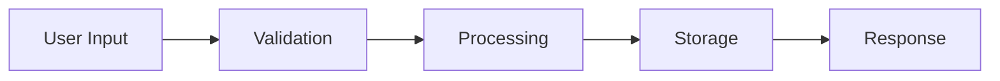

# TIM-XXX: [Module Name]

**TIM ID:** TIM-XXX  
**Module Name:** [Descriptive Module Name]  
**Version:** 1.0  
**Date:** [Date]  
**Estimated Time:** [X weeks/days]  
**Priority:** [High/Medium/Low]  
**Dependencies:** [List of required TIMs]

---

## **1. MODULE OVERVIEW**

### **1.1 Purpose**
[Clear description of what this module accomplishes and why it's needed]

### **1.2 Scope**
**In Scope:**
- [Specific functionality included]
- [Features to be implemented]
- [Components to be created]

**Out of Scope:**
- [What this module will NOT include]
- [Features deferred to other TIMs]

### **1.3 Dependencies**
| Dependency | Type | Description | Status |
|------------|------|-------------|--------|
| TIM-XXX | Hard | Required for core functionality | [Not Started/In Progress/Complete] |
| TIM-XXX | Soft | Nice to have for optimization | [Not Started/In Progress/Complete] |

### **1.4 Success Criteria**
- [ ] [Specific measurable outcome 1]
- [ ] [Specific measurable outcome 2]
- [ ] [Performance benchmark met]
- [ ] [All tests passing]

---

## **2. FUNCTIONAL REQUIREMENTS**

### **2.1 User Stories**

#### **Story 1: [Title]**
```
As a [user type]
I want to [action]
So that [benefit/value]
```

**Acceptance Criteria:**
- [ ] Given [context], when [action], then [expected outcome]
- [ ] Given [context], when [action], then [expected outcome]
- [ ] Error scenario: Given [error context], when [action], then [error handling]

#### **Story 2: [Title]**
[Additional user stories...]

### **2.2 Business Logic**
```typescript
// Example business logic specification
interface BusinessRule {
  validation: (input: any) => boolean;
  action: (input: any) => Result;
  errorHandling: (error: Error) => void;
}
```

### **2.3 Edge Cases**
| Scenario | Input | Expected Behavior | Error Handling |
|----------|-------|-------------------|----------------|
| [Edge case 1] | [Input description] | [Expected result] | [Error response] |
| [Edge case 2] | [Input description] | [Expected result] | [Error response] |

### **2.4 Performance Requirements**
- **Response Time:** [X milliseconds] for [specific operation]
- **Memory Usage:** Maximum [X MB] for [specific scenario]
- **CPU Usage:** Should not exceed [X%] during [operation]
- **Storage:** Efficient data storage with [compression/optimization]

---

## **3. TECHNICAL ARCHITECTURE**

### **3.1 Component Architecture**
```
[Component Hierarchy Diagram]
ComponentA
├── SubComponentB
│   ├── UtilityC
│   └── HelperD
└── SubComponentE
    └── ServiceF
```

### **3.2 Data Flow**


### **3.3 Integration Points**
| Component | Interface | Data Format | Error Handling |
|-----------|-----------|-------------|----------------|
| [External Service] | [API/Function] | [JSON/Object] | [Error strategy] |
| [Internal Module] | [Interface] | [Type] | [Error strategy] |

### **3.4 Technology Stack**
- **Primary:** [React Native/TypeScript/etc.]
- **Libraries:** [Specific packages and versions]
- **Tools:** [Development and build tools]

---

## **4. DATA MODELS & SCHEMA**

### **4.1 Data Structures**
```typescript
// Core data interfaces
interface [EntityName] {
  id: string;
  [property]: [type];
  createdAt: Date;
  updatedAt: Date;
}

interface [RequestType] {
  [property]: [type];
}

interface [ResponseType] {
  success: boolean;
  data?: [type];
  error?: string;
}
```

### **4.2 Database Schema**
```sql
-- If applicable, SQL schema
CREATE TABLE [table_name] (
  id VARCHAR(255) PRIMARY KEY,
  [column_name] [TYPE] [CONSTRAINTS],
  created_at TIMESTAMP DEFAULT CURRENT_TIMESTAMP,
  updated_at TIMESTAMP DEFAULT CURRENT_TIMESTAMP ON UPDATE CURRENT_TIMESTAMP
);
```

### **4.3 Data Validation Rules**
```typescript
const validation = {
  [field]: {
    required: true,
    type: 'string',
    minLength: 1,
    maxLength: 255,
    pattern: /^[a-zA-Z0-9]+$/
  }
};
```

### **4.4 Sample Data**
```json
{
  "example": {
    "id": "uuid-example",
    "property": "value",
    "createdAt": "2024-12-01T10:00:00Z"
  }
}
```

---

## **5. API SPECIFICATIONS**

### **5.1 Endpoints** (if applicable)
```typescript
// Internal API or service interfaces
interface [ServiceName] {
  [methodName](params: [ParamType]): Promise<[ReturnType]>;
}
```

### **5.2 Request/Response Formats**
```typescript
// Request format
interface [RequestName] {
  method: 'GET' | 'POST' | 'PUT' | 'DELETE';
  params: [ParamType];
  headers?: Record<string, string>;
}

// Response format
interface [ResponseName] {
  status: number;
  data: [DataType];
  error?: string;
}
```

### **5.3 Error Handling**
| Error Code | Description | Response | Action |
|------------|-------------|----------|--------|
| 400 | Bad Request | `{error: "Invalid input"}` | Show user error |
| 500 | Server Error | `{error: "Internal error"}` | Retry with backoff |

---

## **6. UI/UX SPECIFICATIONS**

### **6.1 Component Hierarchy**
```
[ScreenName]
├── [HeaderComponent]
├── [ContentComponent]
│   ├── [ListComponent]
│   │   └── [ItemComponent]
│   └── [ActionComponent]
└── [FooterComponent]
```

### **6.2 State Management**
```typescript
interface [ComponentState] {
  loading: boolean;
  data: [DataType][];
  error: string | null;
  filters: [FilterType];
}

// State actions
type [Action] = 
  | { type: 'LOADING'; payload: boolean }
  | { type: 'SET_DATA'; payload: [DataType][] }
  | { type: 'SET_ERROR'; payload: string }
  | { type: 'SET_FILTERS'; payload: [FilterType] };
```

### **6.3 Responsive Design**
| Breakpoint | Layout | Behavior |
|------------|--------|----------|
| Mobile (<768px) | [Layout description] | [Behavior description] |
| Tablet (768-1024px) | [Layout description] | [Behavior description] |
| Desktop (>1024px) | [Layout description] | [Behavior description] |

### **6.4 Styling Specifications**
```typescript
const styles = StyleSheet.create({
  container: {
    flex: 1,
    padding: 16,
    backgroundColor: '#ffffff'
  },
  // Additional styles...
});
```

---

## **7. IMPLEMENTATION STEPS**

### **7.1 File Structure**
```
src/
├── components/
│   ├── [ComponentName]/
│   │   ├── index.ts
│   │   ├── [ComponentName].tsx
│   │   ├── [ComponentName].styles.ts
│   │   └── [ComponentName].test.tsx
├── services/
│   ├── [ServiceName].ts
│   └── [ServiceName].test.ts
├── types/
│   └── [TypeName].ts
└── utils/
    ├── [UtilityName].ts
    └── [UtilityName].test.ts
```

### **7.2 Implementation Sequence**

#### **Step 1: Setup and Configuration** (X hours)
1. Create project structure
   ```bash
   mkdir -p src/components/[ComponentName]
   mkdir -p src/services
   mkdir -p src/types
   ```

2. Install dependencies
   ```bash
   npm install [package-names]
   npm install -D [dev-dependencies]
   ```

3. Configuration files
   ```typescript
   // config/[module].config.ts
   export const config = {
     // Configuration options
   };
   ```

#### **Step 2: Core Implementation** (X hours)
1. **Create base types**
   ```typescript
   // src/types/[TypeName].ts
   export interface [TypeName] {
     // Type definition
   }
   ```

2. **Implement core service**
   ```typescript
   // src/services/[ServiceName].ts
   import { [TypeName] } from '../types/[TypeName]';

   export class [ServiceName] {
     // Implementation
   }
   ```

3. **Create components**
   ```typescript
   // src/components/[ComponentName]/[ComponentName].tsx
   import React from 'react';
   
   interface Props {
     // Props definition
   }
   
   export const [ComponentName]: React.FC<Props> = ({ }) => {
     // Component implementation
   };
   ```

#### **Step 3: Integration** (X hours)
1. Connect services to components
2. Implement state management
3. Add error handling
4. Integrate with existing modules

#### **Step 4: Testing** (X hours)
1. Unit tests for services
2. Component tests
3. Integration tests
4. Manual testing

### **7.3 Code Examples**

#### **Example 1: Core Service Implementation**
```typescript
// src/services/[ServiceName].ts
export class [ServiceName] {
  private [property]: [Type];

  constructor(config: [ConfigType]) {
    // Initialization
  }

  async [methodName](params: [ParamType]): Promise<[ReturnType]> {
    try {
      // Implementation logic
      return result;
    } catch (error) {
      // Error handling
      throw new Error(`[ServiceName] error: ${error.message}`);
    }
  }
}
```

#### **Example 2: React Component**
```typescript
// src/components/[ComponentName]/[ComponentName].tsx
import React, { useState, useEffect } from 'react';
import { View, Text } from 'react-native';
import { styles } from './[ComponentName].styles';

interface Props {
  [propName]: [PropType];
  onAction?: (data: [DataType]) => void;
}

export const [ComponentName]: React.FC<Props> = ({ [propName], onAction }) => {
  const [state, setState] = useState<[StateType]>([initialState]);

  useEffect(() => {
    // Side effects
  }, [[dependencies]]);

  const handleAction = async () => {
    try {
      // Action handling
      onAction?.(result);
    } catch (error) {
      // Error handling
    }
  };

  return (
    <View style={styles.container}>
      <Text>{[propName]}</Text>
      {/* Additional JSX */}
    </View>
  );
};
```

---

## **8. TESTING SPECIFICATIONS**

### **8.1 Unit Tests**
```typescript
// src/services/[ServiceName].test.ts
import { [ServiceName] } from './[ServiceName]';

describe('[ServiceName]', () => {
  let service: [ServiceName];

  beforeEach(() => {
    service = new [ServiceName]([mockConfig]);
  });

  it('should [behavior description]', async () => {
    // Arrange
    const input = [testInput];
    
    // Act
    const result = await service.[methodName](input);
    
    // Assert
    expect(result).toEqual([expectedOutput]);
  });

  it('should handle errors', async () => {
    // Error test case
  });
});
```

### **8.2 Integration Tests**
```typescript
// src/components/[ComponentName]/[ComponentName].test.tsx
import React from 'react';
import { render, fireEvent, waitFor } from '@testing-library/react-native';
import { [ComponentName] } from './[ComponentName]';

describe('[ComponentName]', () => {
  it('should render correctly', () => {
    const { getByText } = render(<[ComponentName] [props] />);
    expect(getByText('[expected text]')).toBeTruthy();
  });

  it('should handle user interaction', async () => {
    const mockAction = jest.fn();
    const { getByTestId } = render(
      <[ComponentName] onAction={mockAction} />
    );
    
    fireEvent.press(getByTestId('[button-test-id]'));
    
    await waitFor(() => {
      expect(mockAction).toHaveBeenCalledWith([expectedData]);
    });
  });
});
```

### **8.3 Manual Testing Checklist**
- [ ] **Happy Path Testing**
  - [ ] [Test scenario 1]
  - [ ] [Test scenario 2]
  
- [ ] **Error Handling**
  - [ ] [Error scenario 1]
  - [ ] [Error scenario 2]
  
- [ ] **Edge Cases**
  - [ ] [Edge case 1]
  - [ ] [Edge case 2]

- [ ] **Performance Testing**
  - [ ] Response time < [X]ms
  - [ ] Memory usage < [X]MB
  - [ ] No memory leaks

### **8.4 Performance Benchmarks**
| Metric | Target | Measurement Method |
|--------|--------|--------------------|
| Load Time | < [X]ms | Performance profiler |
| Memory Usage | < [X]MB | Memory profiler |
| CPU Usage | < [X]% | Performance monitor |

---

## **9. CONFIGURATION & SETUP**

### **9.1 Environment Setup**
```bash
# Required Node.js version
node --version  # Should be >= 18.0.0

# Install dependencies
npm install

# Platform-specific setup
# iOS
cd ios && pod install && cd ..

# Android
# Additional Android setup if needed
```

### **9.2 Dependencies**
```json
{
  "dependencies": {
    "[package-name]": "^[version]"
  },
  "devDependencies": {
    "[dev-package-name]": "^[version]"
  }
}
```

### **9.3 Configuration Files**
```typescript
// config/[module].config.ts
export const [ModuleName]Config = {
  [setting]: '[value]',
  [option]: [number],
  [feature]: {
    enabled: true,
    [subOption]: '[value]'
  }
};
```

### **9.4 Build Instructions**
```bash
# Development build
npm run dev

# Production build
npm run build

# Platform-specific builds
npm run ios
npm run android
npm run web
```

---

## **10. VERIFICATION CRITERIA**

### **10.1 Definition of Done**
- [ ] **Code Complete**
  - [ ] All functionality implemented according to specifications
  - [ ] Code follows project coding standards
  - [ ] No console errors or warnings
  
- [ ] **Testing Complete**
  - [ ] Unit test coverage >= 90%
  - [ ] All integration tests passing
  - [ ] Manual testing checklist completed
  - [ ] Performance benchmarks met
  
- [ ] **Documentation Complete**
  - [ ] Code documentation updated
  - [ ] README updated with new functionality
  - [ ] API documentation updated (if applicable)
  
- [ ] **Integration Complete**
  - [ ] Successfully integrates with existing modules
  - [ ] No breaking changes to existing functionality
  - [ ] Backward compatibility maintained

### **10.2 Acceptance Criteria Checklist**
- [ ] All user stories implemented and tested
- [ ] All edge cases handled appropriately
- [ ] Error handling robust and user-friendly
- [ ] Performance requirements met
- [ ] Security requirements satisfied
- [ ] Accessibility standards met

### **10.3 Quality Gates**
| Gate | Criteria | Status |
|------|----------|---------|
| Code Quality | Linting passing, no critical issues | [ ] |
| Test Coverage | >= 90% line coverage | [ ] |
| Performance | All benchmarks met | [ ] |
| Security | Security scan passing | [ ] |
| Review | Code review approved | [ ] |

### **10.4 Performance Metrics**
```typescript
// Performance monitoring
const metrics = {
  loadTime: '[X]ms',
  memoryUsage: '[X]MB',
  cpuUsage: '[X]%',
  networkRequests: '[X] requests/minute'
};
```

---

## **11. TROUBLESHOOTING GUIDE**

### **11.1 Common Issues**

#### **Issue 1: [Common Problem]**
**Symptoms:** [Description of symptoms]
**Cause:** [Root cause]
**Solution:**
```bash
# Commands to fix
[command]
```

#### **Issue 2: [Another Problem]**
**Symptoms:** [Description]
**Cause:** [Root cause]
**Solution:** [Step-by-step fix]

### **11.2 Debug Commands**
```bash
# Debugging commands
npm run debug
npm run test:debug
npm run analyze
```

### **11.3 Log Analysis**
```typescript
// Logging configuration
import { Logger } from '../utils/logger';

const logger = new Logger('[ModuleName]');
logger.debug('[Debug message]');
logger.error('[Error message]', error);
```

---

## **12. INTEGRATION CHECKPOINTS**

### **12.1 Pre-Integration Checklist**
- [ ] All dependencies satisfied
- [ ] Unit tests passing
- [ ] Code review completed
- [ ] Documentation updated

### **12.2 Integration Testing**
- [ ] Module integrates successfully with [DependentModule]
- [ ] No breaking changes to existing functionality
- [ ] End-to-end workflows function correctly
- [ ] Performance impact assessed

### **12.3 Post-Integration Verification**
- [ ] System tests passing
- [ ] Integration tests updated
- [ ] Monitoring and logging configured
- [ ] Rollback plan prepared

---

## **13. MAINTENANCE NOTES**

### **13.1 Future Enhancements**
- [Enhancement idea 1]
- [Enhancement idea 2]
- [Optimization opportunity]

### **13.2 Known Limitations**
- [Limitation 1 and workaround]
- [Limitation 2 and future fix]

### **13.3 Dependencies to Monitor**
- [External dependency] - [Reason to monitor]
- [Library] - [Update schedule/considerations]

---

**TIM Completion Date:** [Date]  
**Implemented By:** [Developer Name]  
**Reviewed By:** [Reviewer Name]  
**Next TIM:** TIM-[XXX]